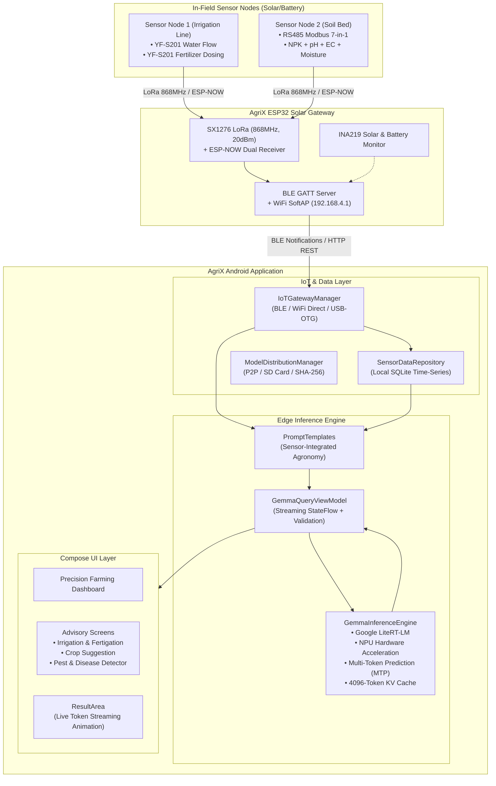

# AgriX Offline System Architecture

## 1. High-Level System Architecture

AgriX is a completely offline-first precision agriculture platform designed for Indian smallholder farmers operating in remote environments with zero or intermittent internet connectivity.

---

## 2. Core Subsystems

### A. Edge AI Inference Engine (`com.protoprojects.agrix.ai`)
* **Model:** Gemma 3 1B Instruction-Tuned (int4-quantized, 4096 context window).
* **Runtime:** Google LiteRT-LM (with fallback to MediaPipe LLM Inference).
* **Hardware Acceleration:** Native NPU delegation with automatic GPU and CPU fallbacks.
* **Speedup Optimization:** Speculative Multi-Token Prediction (MTP) delivering ~2.2x faster token decode on mobile chips.
* **Context Preservation:** Stateful `Conversation` API allowing multi-turn agronomy dialogues without leaking state across unrelated features.

### B. IoT Gateway & Field Sensors (`com.protoprojects.agrix.iot`)
* **Transport:** Dual-mode Bluetooth Low Energy (GATT streaming) and local WiFi SoftAP (`http://192.168.4.1/telemetry`).
* **Sensor Capabilities:**
  - Water flow rate and cumulative volume (YF-S201).
  - Fertilizer dosing rate and cumulative volume (YF-S201).
  - Soil Nitrogen, Phosphorus, Potassium (NPK probe via RS485 Modbus).
  - Soil pH, electrical conductivity (EC), moisture %, and soil temperature.

### C. Local Persistence (`com.protoprojects.agrix.data`)
* **Sensor History:** SQLite time-series database (`SensorDataRepository`) for recording telemetry and computing trend lines.
* **Farmer Profile:** Preferences DataStore storing farm dimensions, soil baseline, primary crops, and language preference.
* **Model Distribution:** Local file storage (`models/`) managed by `ModelDistributionManager` supporting offline sideloading and P2P sharing with SHA-256 verification.
